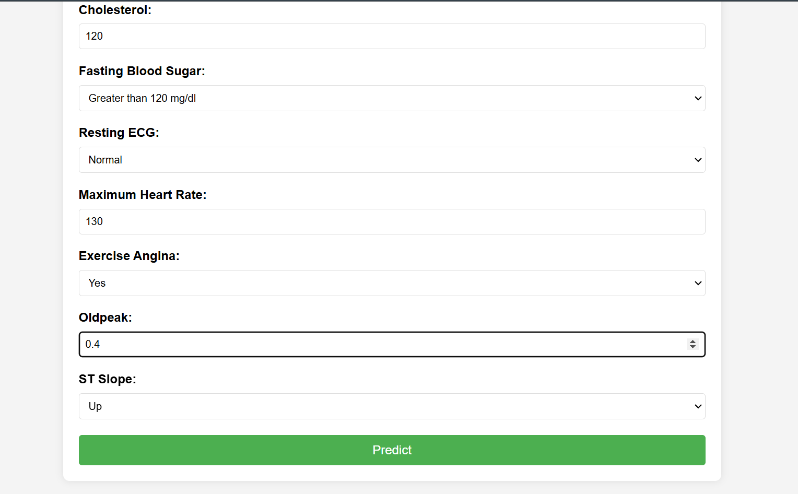
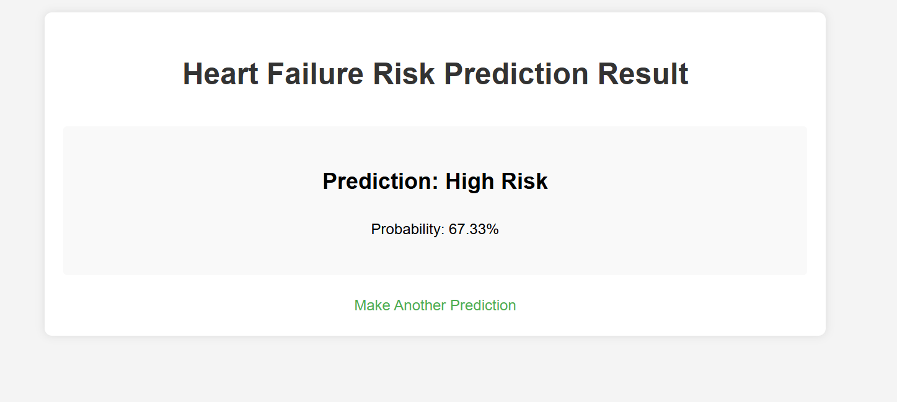

# Heart Failure Prediction Web Application

This is a web-based application that predicts the risk of heart failure using machine learning. The application uses a Random Forest model trained on medical data to provide risk assessments.

## Features

- User-friendly web interface for input of medical parameters
- Real-time prediction of heart failure risk
- Probability score for predictions
- Responsive design
- Input validation for all fields

   
